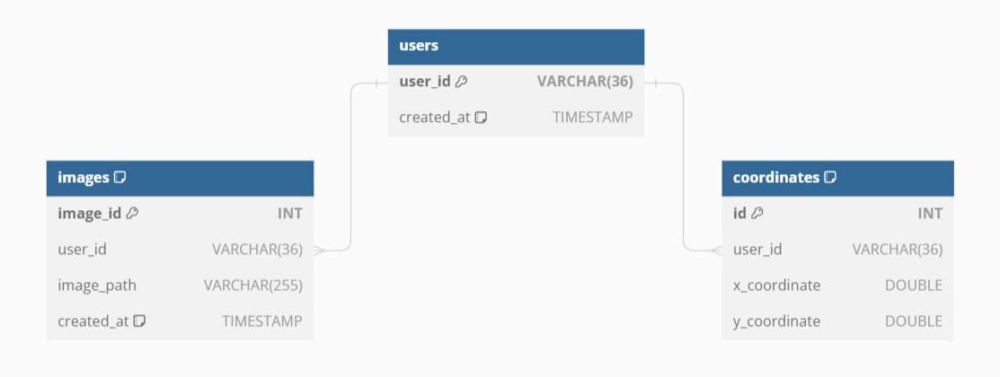

# Mouse Tracker Application

## Description

This project comprises two interconnected applications, each serving distinct functionalities:

- **Camera API**: A dedicated service handling OpenCV logic. It provides an endpoint to capture images using a webcam.
  External requests can be made to this API to trigger the webcam and capture images.

- **WebSocket-Based Interaction Application**: This application enables real-time communication with multiple clients
  simultaneously using WebSockets. It operates in a browser environment, tracking mouse movements and recording
  right-click events. The mouse movements are translated into coordinates that, along with the path of any captured
  image, are stored in the database. Right-click events trigger a request to the Camera API, which then captures a photo
  from the webcam. The captured image itself is saved locally in a 'pictures' folder within the project, created
  dynamically if it does not already exist. This approach ensures efficient tracking and retrieval of both mouse
  activity data and image capture events.

- **Efficiency with Redis**: To optimize performance, Redis is employed to batch mouse coordinates in memory before
  persistently storing them in MariaDB. This batching mechanism improves data handling efficiency by reducing the
  frequency of database write operations.

The integration of these components provides a seamless user experience, allowing for efficient tracking of mouse
movements and convenient image capturing through webcam interactions.

## Technologies Used

- **FastAPI**: High-performance web framework for building APIs with Python, used for the backend.
- **JavaScript**: Minimal JavaScript is used for handling real-time interactions on the frontend.
- **WebSockets**: Employed for real-time communication between the client and server.
- **MariaDB**: Open-source relational database for storing user data, coordinates, and images.
- **Redis**: In-memory data structure store, used for caching and as a message broker.
- **Asynchronous Programming**: Applied throughout the application for efficient task handling.
- **Database Connection Pooling**: Enhances database interaction efficiency.
- **Docker & Docker Compose**: Used for containerization and service orchestration.
- **HTML & CSS**: Basic HTML and CSS for crafting the user interface.
  The technologies and tools chosen for this project ensure a blend of performance, reliability, and ease of
  development.

## Visuals

### Relational Database Schema

## Prerequisites

- Python 3.8+
- Docker and Docker Compose

## Installation

- Run the script `start_camera_api.sh` located at the root directory or manually go through the commands one by one
  within the file.
- In separate terminal run `docker-compose up --build`.

Alternatively, manually go through the

## Usage

To use the application, follow these steps:

1. **Open a web browser, such as Google Chrome, and navigate to http://127.0.0.1:8000/static/.**

2. **As you move your mouse within the browser window, the mouse coordinates will be displayed both on the static page
   and in the terminal running the application. Alongside the coordinates, you will also see additional system
   information in the terminal.**

3. **Initially, you might notice a message indicating that the connection to the database has not been established.
   However, the application is designed to automatically retry the connection, so there is no need for concern.**

4. **If you wish to view the saved information in the database, you can access MariaDB using a database management tool
   like MySQL Workbench. The database is accessible through the exposed port 7379.**